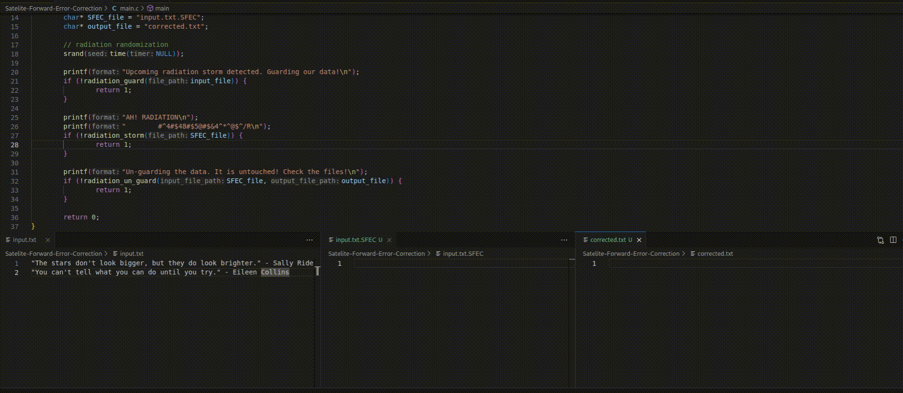

# Satellite Forward-Error Correction (SFEC)

**SFEC** is a technology designed to correct errors introduced during data transmission between satellites and ground stations. Radiation can corrupt data, rendering it useless. SFEC helps ensure its integrity.

## Use Case: Correcting Errors Caused by Space Radiation

This animation illustrates the impact of space radiation on data transmission.
This particular scheme can, to some extent, remediate these issues.

1. Leftmost box showcases the initial input.
2. In the middle, radiation is constantly altering the intermediary representation created via SFEC. This file has a '.SFEC' format.
3. Finally, on the rightmost side, we can see how 'radiation_un_guard' is able to recover the altered data.
## License
Licensed under the GNU General Public License v3.0. See LICENSE for detail.